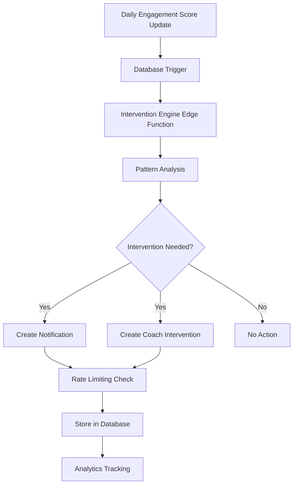

# BEE Momentum Meter - Intervention Rule Engine

**Epic:** 1.1 · Momentum Meter  
**Task:** T1.1.2.5 · Implement intervention rule engine for notifications  
**Status:** ✅ Complete  
**Created:** December 2024  

---

## 🎯 **Overview**

The Intervention Rule Engine is an automated system that monitors user momentum patterns and triggers appropriate interventions to support user engagement. It analyzes momentum history to identify when users need support, encouragement, or celebration, then creates targeted notifications and coach interventions.

### **Key Features**
- **Automated Pattern Detection**: Identifies concerning patterns like consecutive "Needs Care" days
- **Smart Notifications**: Creates personalized, encouraging messages for different scenarios
- **Coach Intervention Triggers**: Automatically schedules coach calls for high-priority cases
- **Rate Limiting**: Prevents notification spam while ensuring timely support
- **Analytics Tracking**: Monitors intervention effectiveness and user response

---

## 🏗️ **Architecture**

### **System Components**



### **Core Components**

1. **Flutter Service**: `app/lib/core/services/coach_intervention_service.dart` (465+ lines)
   - Native intervention logic handling
   - Coach dashboard integration
   - Real-time intervention management

2. **Push Notification Function**: `functions/push-notification-triggers/index.ts` (665 lines)
   - Intervention triggers and notification delivery
   - Batch processing for all users
   - Firebase Cloud Messaging integration

3. **Database Infrastructure**: Complete intervention and notification tables
   - Automatic intervention checks on score updates
   - Rate limiting tables and functions
   - Analytics views and tracking

4. **Testing**: Functionality tested via Flutter service tests (intervention logic tested natively)
   - Comprehensive testing of all intervention scenarios via CoachInterventionService
   - Integration tests for database operations
   - Performance and error handling tests in Flutter environment

---

## 🔍 **Intervention Types**

### **1. Consecutive Needs Care (High Priority)**
**Trigger**: 2+ consecutive days in "Needs Care" state  
**Action**: Schedule coach call + supportive notification  
**Rate Limit**: 1 per day, 24 hours between  

```json
{
  "type": "coach_intervention",
  "priority": "high",
  "reason": "consecutive_needs_care",
  "notification": {
    "title": "Let's grow together! 🌱",
    "message": "We've noticed you might need some extra support. Your coach is here to help you get back on track!",
    "action_type": "schedule_call"
  }
}
```

### **2. Significant Score Drop (Medium Priority)**
**Trigger**: 15+ point score drop over 3 days  
**Action**: Encouraging notification with lesson suggestion  
**Rate Limit**: 2 per day, 8 hours between  

```json
{
  "type": "supportive_notification",
  "priority": "medium", 
  "reason": "score_drop",
  "notification": {
    "title": "You've got this! 💪",
    "message": "Everyone has ups and downs. Let's focus on small wins today - you're stronger than you know!",
    "action_type": "complete_lesson"
  }
}
```

### **3. Celebration (Low Priority)**
**Trigger**: 4+ out of 5 days in "Rising" state  
**Action**: Celebration notification  
**Rate Limit**: 1 per day, 12 hours between  

```json
{
  "type": "celebration",
  "priority": "low",
  "reason": "sustained_rising", 
  "notification": {
    "title": "Amazing momentum! 🎉",
    "message": "You've been consistently Rising for days! Your dedication is truly inspiring. Keep up the fantastic work!",
    "action_type": "view_momentum"
  }
}
```

### **4. Consistency Reminder (Low Priority)**
**Trigger**: 4+ state transitions in 7 days (irregular pattern)  
**Action**: Gentle reminder about consistency  
**Rate Limit**: 1 per day, 24 hours between  

```json
{
  "type": "consistency_reminder",
  "priority": "low",
  "reason": "irregular_pattern",
  "notification": {
    "title": "Consistency is key 🗝️",
    "message": "Small, regular steps lead to big changes. Let's find a rhythm that works for you!",
    "action_type": "journal_entry"
  }
}
```

---

## 🚀 **Usage**

### **Automatic Triggers**
The intervention system runs automatically through native Flutter integration:

```dart
// CoachInterventionService handles automatic interventions
final interventionService = CoachInterventionService.instance;

// Check and schedule interventions based on momentum data
final recommendation = await interventionService.checkInterventionNeeded(
  userId: currentUser.id,
  momentumData: currentMomentumData,
);

if (recommendation != null) {
  final result = await interventionService.scheduleIntervention(
    userId: currentUser.id,
    type: recommendation.type,
    priority: recommendation.priority,
    reason: recommendation.reason,
    momentumData: currentMomentumData,
  );
}
```

### **Manual Invocation**
Schedule interventions directly through the Flutter service:

```dart
// Schedule specific intervention type
final result = await CoachInterventionService.instance.scheduleIntervention(
  userId: userId,
  type: InterventionType.momentumDrop,
  priority: InterventionPriority.high,
  reason: 'Significant momentum decrease detected',
  momentumData: {'score': 30.0, 'state': 'NeedsCare'},
);

if (result.success) {
  print('Intervention scheduled: ${result.interventionId}');
}
```

### **Bulk Processing**
Push notification triggers handle batch processing for all users:

```dart
// Processed automatically by push-notification-triggers function
// No manual invocation needed - runs on momentum score updates
```

---

## ⚙️ **Configuration**

### **Rate Limiting Configuration**
Stored in `intervention_config` table:

```sql
-- View current rate limits
SELECT config_value FROM intervention_config 
WHERE config_key = 'rate_limits';

-- Update rate limits
UPDATE intervention_config 
SET config_value = '{
  "consecutive_needs_care": {"max_per_day": 1, "min_hours_between": 24},
  "score_drop": {"max_per_day": 2, "min_hours_between": 8},
  "celebration": {"max_per_day": 1, "min_hours_between": 12},
  "consistency_reminder": {"max_per_day": 1, "min_hours_between": 24}
}'
WHERE config_key = 'rate_limits';
```

### **Intervention Thresholds**
Customize when interventions trigger:

```sql
-- Update thresholds
UPDATE intervention_config 
SET config_value = '{
  "score_drop_threshold": 15,
  "consecutive_needs_care_days": 2,
  "celebration_rising_days": 4,
  "consistency_transition_threshold": 4
}'
WHERE config_key = 'thresholds';
```

### **Notification Templates**
Control notification formatting:

```sql
-- Update template settings
UPDATE intervention_config 
SET config_value = '{
  "enabled": true,
  "personalization": true,
  "include_emoji": true,
  "max_message_length": 160
}'
WHERE config_key = 'notification_templates';
```

---

## 📊 **Analytics & Monitoring**

### **Intervention Effectiveness**
Monitor how well interventions are working:

```sql
-- View intervention effectiveness summary
SELECT * FROM intervention_effectiveness_summary;

-- Results show:
-- - Delivery rates (sent → delivered → opened → clicked)
-- - Average response times
-- - Momentum impact (score changes after intervention)
-- - State transition outcomes
```

### **Individual Intervention Analysis**
Detailed view of specific interventions:

```sql
-- Analyze specific intervention types
SELECT 
    notification_type,
    AVG(score_change) as avg_score_impact,
    COUNT(CASE WHEN score_change > 0 THEN 1 END) as positive_outcomes,
    AVG(hours_to_open) as avg_engagement_time
FROM intervention_analytics 
WHERE trigger_date >= CURRENT_DATE - INTERVAL '30 days'
GROUP BY notification_type;
```

### **Rate Limiting Monitoring**
Track intervention frequency:

```sql
-- Check rate limiting effectiveness
SELECT 
    user_id,
    intervention_type,
    COUNT(*) as total_attempts,
    MAX(last_triggered_at) as last_intervention
FROM intervention_rate_limits 
WHERE last_triggered_at >= CURRENT_DATE - INTERVAL '7 days'
GROUP BY user_id, intervention_type
ORDER BY total_attempts DESC;
```

---

## 🧪 **Testing**

### **Flutter Service Testing**
```bash
# Test intervention functionality via Flutter service
cd app
flutter test test/core/services/coach_intervention_service_test.dart

# Test coach dashboard functionality
flutter test test/features/momentum/presentation/screens/coach_dashboard/
```

### **Note**: Intervention logic is tested via native Flutter CoachInterventionService rather than separate cloud function tests, as the functionality has been consolidated into the Flutter application for better performance and maintainability.

---

## 🔧 **Deployment**

### **Supabase Edge Function Deployment**
```bash
# Deploy the intervention engine function
supabase functions deploy momentum-intervention-engine

# Set environment variables
supabase secrets set SUPABASE_URL=your-project-url
supabase secrets set SUPABASE_SERVICE_ROLE_KEY=your-service-key
```

### **Database Migration**
```bash
# Apply intervention triggers migration
supabase db push

# Verify tables were created
supabase db diff --schema public
```

### **Scheduled Processing**
Set up a cron job or scheduled function to process all users:

```typescript
// Schedule daily intervention check (example with Supabase Cron)
SELECT cron.schedule(
  'daily-intervention-check',
  '0 9 * * *', -- 9 AM daily
  $$
  SELECT net.http_post(
    url := 'https://your-project.supabase.co/functions/v1/momentum-intervention-engine',
    headers := '{"Authorization": "Bearer ' || current_setting('app.supabase_service_key') || '", "Content-Type": "application/json"}',
    body := '{"check_all_users": true}'
  );
  $$
);
```

---

## 🚨 **Error Handling**

### **Common Issues & Solutions**

**1. pg_net Extension Missing**
```sql
-- Enable pg_net for HTTP requests from triggers
CREATE EXTENSION IF NOT EXISTS pg_net;
```

**2. Rate Limiting Too Aggressive**
```sql
-- Adjust rate limits if users aren't getting enough support
UPDATE intervention_config 
SET config_value = jsonb_set(
  config_value, 
  '{consecutive_needs_care,max_per_day}', 
  '2'
)
WHERE config_key = 'rate_limits';
```

**3. Edge Function Timeout**
```typescript
// Add timeout handling in Edge Function
const controller = new AbortController();
const timeoutId = setTimeout(() => controller.abort(), 30000); // 30s timeout

try {
  const result = await processInterventions(userId, { signal: controller.signal });
  clearTimeout(timeoutId);
  return result;
} catch (error) {
  if (error.name === 'AbortError') {
    console.log('Intervention processing timed out');
  }
  throw error;
}
```

---

## 📈 **Performance Considerations**

### **Database Optimization**
- Indexes on `user_id`, `score_date`, and `momentum_state` for fast queries
- JSONB indexes on metadata fields for flexible querying
- Partitioning for large notification tables (future enhancement)

### **Rate Limiting Efficiency**
- Composite unique constraints prevent duplicate rate limit entries
- Efficient date-based queries with proper indexing
- Automatic cleanup of old rate limit records

### **Edge Function Performance**
- Batch processing for multiple users
- Async/await for database operations
- Error isolation per user to prevent cascade failures

---

## 🔮 **Future Enhancements**

### **Planned Improvements**
1. **Machine Learning Integration**: Use ML to predict optimal intervention timing
2. **Personalized Templates**: Dynamic message generation based on user preferences
3. **A/B Testing Framework**: Test different intervention strategies
4. **Real-time Notifications**: WebSocket integration for instant notifications
5. **Coach Dashboard**: Real-time intervention queue for coaches

### **Scalability Considerations**
- Message queue integration for high-volume processing
- Distributed rate limiting with Redis
- Notification delivery service integration (FCM, APNs)
- Multi-tenant support for different organizations

---

## 📚 **Related Documentation**

- [Momentum Calculation Algorithm](./momentum-calculation-algorithm.md)
- [Zone Classification Logic](./zone-classification-logic.md)
- [API Endpoints Specification](./api-endpoints-specification.md)
- [Database Schema](../../supabase/migrations/20241215000000_momentum_meter.sql)
- [Task Breakdown](../tasks-momentum-meter.md)

---

**Implementation Status**: ✅ **Complete**  
**Next Task**: [T1.1.2.6 - Create Supabase Edge Functions for score calculation](../tasks-momentum-meter.md#t1126) 