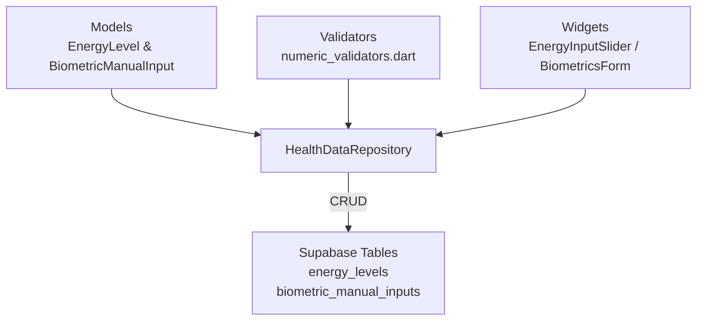

# Bee Mobile App – UI Foundation Layer

_This document describes the shared Flutter UI components added in the **UI
Foundation Layer Refactor** (July 2025) and how they fit into the overall
architecture._

## Folder Structure

```
app/lib/
  core/
    ui/
      widgets/           ← low-level reusable widgets
        bee_text_field.dart
      bee_toast.dart     ← helper for SnackBars / toasts
      bee_dropdown.dart  ← generic dropdown (U7)
      bee_primary_button.dart ← primary action button with loading state (U7)
    validators/
      auth_validators.dart
      numeric_validators.dart
```

- All UI foundation widgets live under `core/ui/` so feature modules can import
  them without circular deps.
- Widgets **must not** hold business logic; state is passed in via parameters or
  managed externally with Riverpod.
- No _magic numbers_: sizes & spacing come from
  `core/services/responsive_service.dart` and theme extensions.

## Components

| Widget / Helper               | Purpose                                                   | Key APIs                                                  |
| ----------------------------- | --------------------------------------------------------- | --------------------------------------------------------- |
| **BeeTextField**              | Unified text input with label, validation, obscure toggle | `label`, `validator`, `obscureText`, `hint`, `suffixIcon` |
| **BeeToast** (`showBeeToast`) | Standardised SnackBar for success/error/info              | `message`, `type`, `duration`                             |
| **BeeDropdown**               | Generic dropdown used across forms                        | `items`, `onChanged`, `initialValue`                      |
| **BeePrimaryButton**          | Primary CTA with loading spinner                          | `label`, `onPressed`, `isLoading`                         |

## Validators

Common validators were moved into `core/validators/`:

- `auth_validators.dart`: email and password strength checks
- `numeric_validators.dart`: numeric range & unit validators

Exposing these in one place ensures consistent error messages and easier
updates.

## Lint Rule

`analysis_options.yaml` now forbids raw `TextFormField` usage outside `core/`.
Use **BeeTextField** instead. During migration this rule is a _warning_; it will
be flipped to an _error_ after adoption reaches ≥ 80 %.

## Adoption Guidelines

1. Import the widget:
   `import 'package:app/core/ui/widgets/bee_text_field.dart';`
2. Prefer passing a `TextEditingController` when you need imperative access.
3. For one-off validators, inline a closure. For shared logic, add to
   `core/validators/`.
4. Use **BeeToast** for all user-visible feedback; do not call
   `ScaffoldMessenger.of(context).showSnackBar` directly.

> **Heads-up for new contributors:** A quick reference table of all foundation
> widgets (and how to extend them) now lives in
> `app/lib/core/ui/widgets/README.md`. Check that file first before adding new
> UI controls.

## Theming & Accessibility

- All widgets derive colours & font sizes from the global `ThemeData` so they
  adapt to dark mode automatically.
- Navigation & dialog semantics follow Flutter a11y recommendations; new widgets
  include semantic labels where appropriate.
- Detailed colour token definitions & WCAG AA contrast ratios are maintained in
  `docs/architecture/theme_guidelines.md`; consult this file before adding or
  modifying colours.

## Health Data Module

The `core/health_data/` module acts as a **domain-centric slice** that unifies
models, validators, repository layer, and (upcoming) widgets dealing with user
health signals.

```
app/lib/core/health_data/
  models/            ← EnergyLevel, BiometricManualInput, MetabolicScore
  services/          ← HealthDataRepository (Riverpod)
  validators/        ← numeric_validators.dart
  widgets/           ← EnergyInputSlider, BiometricsForm, …
```

### Data flow



The repository caches in memory and syncs with Supabase tables secured by
Row-Level Security (RLS).

---

_Last updated: 2025-07-18_
