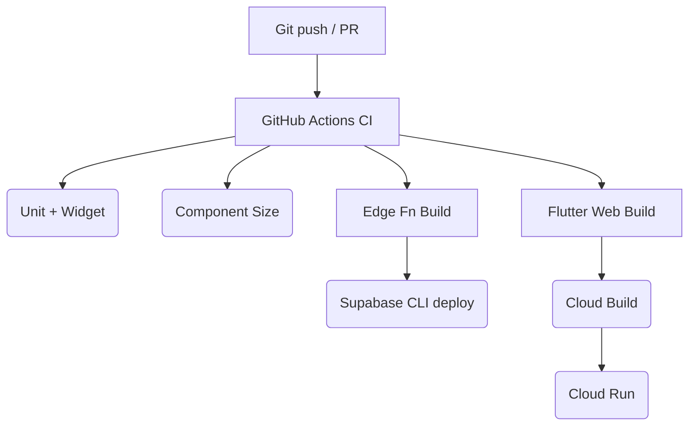

# Behavioral Engagement Engine (BEE) – MVP Technical Architecture Overview

**Version:** 1.0\
**Last Updated:** 2025-01-15\
**Scope:** Minimum-Viable Product (MVP)

---

## 1 ⃣ Layered System Diagram

```
Flutter App  ──► GraphQL/REST ▶──┐
                             │
                     Supabase*  ←—► Postgres 15  (pgvector)
                             │
        Supabase Edge Fn ⇆ Pub/Sub
                             │
                    BigQuery ⇆ Vertex AI
                             │
                     Cloud Storage (GCS)
```

*Future: swap Supabase for **Hasura + Cloud Run** once BAA signed.

### Key SLAs

| Metric              | Target          |
| ------------------- | --------------- |
| **API p95 latency** | < 1 s           |
| **Burst capacity**  | 30 req/min/user |
| **Uptime**          | 99 %            |
| **Error rate**      | < 1 %           |

---

## 2 🔁 Additional Request / Response Flows

### 2.1 Auth – Email Sign-In

```mermaid
sequenceDiagram
    autonumber
    User→>Flutter App: Enter credentials
    Flutter App→>Supabase Auth: POST /token?grant_type=password
    Supabase Auth-->>Flutter App: 200 OK { access_token, refresh_token }
    Flutter App->>Secure Storage: save tokens
```

### 2.2 AI Coaching Edge Function

```mermaid
sequenceDiagram
    autonumber
    User→>Flutter App: Send chat message
    Flutter App→>Supabase Edge Fn: POST /ai-coaching-engine/generate-response
    Edge Fn→>Vertex AI / OpenAI: createCompletion()
    Edge Fn-->>Flutter App: 200 OK { response_text, usage }
```

---

## 3 🗄️ Core Data Entities (Snapshot)

| Table                      | Purpose                      | Key Columns                                          |
| -------------------------- | ---------------------------- | ---------------------------------------------------- |
| `engagement_events`        | Raw user actions             | id, user_id, event_type, event_date, metadata        |
| `daily_engagement_scores`  | Aggregated momentum score    | id, user_id, score_date, final_score, momentum_state |
| `user_fcm_tokens`          | Push-token registry          | id, user_id, fcm_token, platform, is_active          |
| `momentum_notifications`   | Notification log             | id, user_id, notification_type, sent_at              |
| `coach_memory` _(planned)_ | Store personalization traits | id, user_id, trait_key, trait_value                  |

_(See Supabase migrations for full DDL.)_

---

## 4 🌐 Environments & Secrets

| Environment      | API Host                                     | DB                 | Notes                                        |
| ---------------- | -------------------------------------------- | ------------------ | -------------------------------------------- |
| **Local Dev**    | `http://localhost:54321/functions/v1`        | Supabase Docker    | `.env.local` + `~/.bee_secrets/supabase.env` |
| **Staging**      | `https://bee-stage.supabase.co/functions/v1` | Supabase Cloud     | GitHub-secret tokens                         |
| **Prod (HIPAA)** | `https://api.bee-prod.com/v1`                | Cloud SQL + Hasura | Google Secret Manager                        |

Secrets locations

- Flutter: `app/.env` (git-ignored) – API host & anon key.
- Supabase CLI / CI: `~/.bee_secrets/supabase.env`.
- GitHub Actions: repository secrets `SUPABASE_ACCESS_TOKEN`, `OPENAI_API_KEY`,
  etc.

---

## 5 🏷️ Versioning & API Conventions

- **API prefix:** All public routes start with `/v1/` _(e.g.,
  `/v1/momentum/calculate`)_.
- **Error envelope:** `{ "error": { "code": "string", "message": "string" } }`.
- **Edge Functions:** Must be tagged using **SemVer** (`v1.2.0`) in function
  metadata & release notes.

---

## 6 ⃣ Technology Stack (TL;DR)

| Layer              | Tech                                | Rationale                    |
| ------------------ | ----------------------------------- | ---------------------------- |
| **Client**         | Flutter 3.3.2a + Riverpod v2        | Cross-platform, reactive     |
| **API**            | Supabase Auto-REST / Edge Functions | Fast, serverless             |
| **Auth**           | Supabase Auth                       | Turn-key JWT                 |
| **DB**             | Postgres 15 + pgvector              | Structured + embedding ready |
| **Async / PubSub** | Supabase Realtime / GCP Pub/Sub     | Real-time events             |
| **AI/ML**          | Vertex AI + OpenAI/Claude           | Managed inference            |
| **Analytics**      | BigQuery                            | Massive SQL                  |
| **CI/CD**          | GitHub Actions → Cloud Build        | Automated deploys            |
| **IaC**            | Terraform                           | Reproducible infra           |

---

## 7 ⃣ Deployment Pipeline



---

## 8 ⃣ Monitoring & Logging

- **APM & Logs:** Cloud Logging + Cloud Monitoring dashboards
- **Error Tracking:** Sentry (Flutter) + Log-based alerts
- **Metrics Dashboards:** Grafana board (see `monitoring/grafana/`)
- **Audit Trails:** Cloud Audit Logs retained 7 years.

---

## 9 ⃣ Security & Compliance Snapshot

- **Encryption:** TLS 1.2+, all data at-rest with CMEK.
- **Auth:** JWT + RLS (see `supabase/config.toml`).
- **Rate Limiting:** 30 req/min/user (Edge Fn) + Supabase policies.
- **HIPAA Path:** Sign Google Cloud BAA → migrate DB to Cloud SQL.
- **PII Handling:** Follow `SECURITY_DOCS/` guidelines.

---

## 10 ⃣ References & Deep-Dive Docs

- Component governance and size limits:
  `docs/architecture/component_governance.md`
- MVP roadmap & epics: `docs/bee_project_plan_v4.md`
- Edge-function source examples: `supabase/functions/`
- CI workflow definitions: `.github/workflows/`

---

_End of document_
