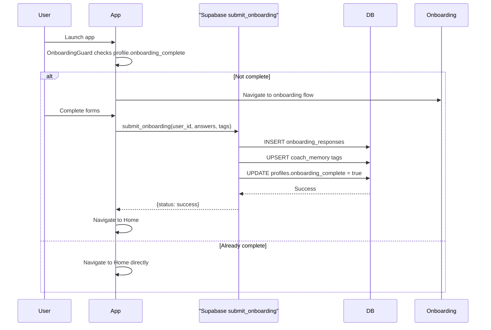

## Onboarding Completion Flow (M1.11.6)

Below sequence shows how the app submits onboarding data via Supabase and
navigates the user to Home on success.

```mermaid
sequenceDiagram
    participant User
    participant App
    participant SupabaseRPC as "Supabase submit_onboarding"
    participant DB

    User->>App: Launch app
    App->>App: OnboardingGuard checks profile.onboarding_complete
    alt Not complete
        App->>Onboarding: Navigate to onboarding flow
        User->>App: Complete forms
        App->>SupabaseRPC: submit_onboarding(user_id, answers, tags)
        SupabaseRPC->>DB: INSERT onboarding_responses
        SupabaseRPC->>DB: UPSERT coach_memory tags
        SupabaseRPC->>DB: UPDATE profiles.onboarding_complete = true
        DB-->>SupabaseRPC: Success
        SupabaseRPC-->>App: {status: success}
        App->>App: Navigate to Home
    else Already complete
        App->>App: Navigate to Home directly
    end
```
