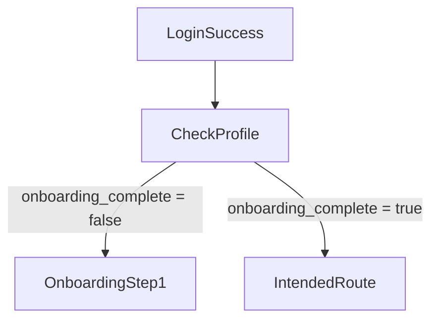

# Deep-Link Behaviour & `OnboardingGuard`

Milestone **M1.11.6** · Action **C5**\
Status: 🟡 Draft – pending review

---

## Guard Responsibility

`OnboardingGuard` intercepts navigation after auth to ensure users who have not
completed onboarding are routed to the first onboarding step.

---

## Deep-Link Scenarios

| Scenario | Incoming Link                   | Guard Result                                |
| -------- | ------------------------------- | ------------------------------------------- |
| 1        | `bee://home`                    | Redirect to `/onboarding/step1`             |
| 2        | `bee://lesson/123`              | Redirect to `/onboarding/step1`             |
| 3        | `bee://onboarding/step3`        | Allowed (guard passes; still in onboarding) |
| 4        | `bee://home` (after completion) | Allowed                                     |

---

## Implementation Notes

- Built with **go_router** `redirect` callback inside `supabase_provider.dart`.
- Guard queries `profiles.onboarding_complete` via persisted session RPC.
- Uses **Riverpod** `FutureProvider` to expose flag; UI shows loader until
  resolved.
- All external `RouteInformationProvider` updates pass through guard.

---

## Testing

1. **Unit:** Simulate `go_router` redirect with mocked profile states.
2. **Integration:** Launch app via deep-link intent before & after completion.
3. **E2E:** Patrol tests covering scenarios 1 & 4.

---

_Author: AI Pair-Programmer\
Date: 2025-07-11_
