# 🔧 Technical Handoff: Database Constraint Issue

**Date:** January 6, 2025\
**Epic:** 1.2 Today Feed Recovery Plan\
**Milestone:** M1.2.1.4: Testing & Deployment\
**Status:** 95% Complete - Database constraint blocking production content
generation

---

## 📊 **Current Status Summary**

### ✅ **Completed Successfully**

- **M1.2.1.1**: AI Content Generation Infrastructure ✅ **COMPLETE**
- **M1.2.1.2**: Database Integration ✅ **COMPLETE**
- **M1.2.1.3**: Quality Assurance & Safety ✅ **COMPLETE**
- **M1.2.1.4**: Testing & Deployment ✅ **95% COMPLETE**

### 🔧 **M1.2.1.4 Status Breakdown**

- ✅ **T1.2.1.4.1**: Unit tests for AI content generation (5 tests passing)
- ✅ **T1.2.1.4.2**: Integration tests (end-to-end testing working)
- ✅ **T1.2.1.4.3**: Deploy to production - **FUNCTIONS DEPLOYED SUCCESSFULLY**

### 🚧 **Outstanding Issue**

**Production AI content generation blocked by database constraint violation**

---

## 🐛 **Database Constraint Issue Details**

### **Error Message**

```json
{
   "error": "Failed to generate daily content",
   "message": "Failed to save content: new row for relation \"content_change_log\" violates check constraint \"content_change_log_action_type_check\"",
   "response_time_ms": 3681
}
```

### **Root Cause Analysis**

1. **Functions are deployed correctly** ✅
   - `ai-coaching-engine` deployed (version 8)
   - `daily-content-generator` deployed (version 1)
   - Both endpoints accessible and responding

2. **API endpoints working** ✅
   - Production URLs: `https://okptsizouuanwnpqjfui.supabase.co/functions/v1/`
   - Authentication: Service role key required for function calls
   - Network connectivity: Confirmed working

3. **Database constraint violation** ❌
   - Table: `content_change_log`
   - Constraint: `content_change_log_action_type_check`
   - Issue: New row violates check constraint when saving generated content

### **Technical Flow Analysis**

```mermaid
graph TD
    A[daily-content-generator] --> B[ai-coaching-engine]
    B --> C[AI Content Generation]
    C --> D[Content Safety Validation]
    D --> E[Save to daily_feed_content]
    E --> F[Save to content_change_log] 
    F --> G[❌ Constraint Violation]
    
    style G fill:#ff9999
    style A fill:#99ff99
    style B fill:#99ff99
    style C fill:#99ff99
    style D fill:#99ff99
    style E fill:#99ff99
```



**Working:** Steps A-E complete successfully\
**Failing:** Step F - `content_change_log` constraint violation

---

## 🔍 **Investigation Steps Completed**

### **1. Deployment Verification** ✅

- Functions deployed using automated `test-deploy` script
- Production API keys configured correctly
- Service role authentication working

### **2. Endpoint Testing** ✅

```bash
# AI Coaching Engine Test
curl -X POST "https://[SUPABASE_URL]/functions/v1/ai-coaching-engine/generate-daily-content" \
  -H "Authorization: Bearer $PROD_SERVICE_ROLE_KEY" \
  -H "Content-Type: application/json" \
  -d '{"content_date": "2025-01-06"}'

# Result: Function responds but fails on database save
```

### **3. Function Flow Analysis** ✅

- `daily-content-generator`: Orchestrator that calls ai-coaching-engine
- `ai-coaching-engine`: Generates content, validates safety, saves to DB
- Timeout behavior: Functions hang for 30+ seconds due to constraint error

---

## 🛠️ **Recommended Fixes**

### **Priority 1: Database Schema Investigation**

1. **Check constraint definition**:
   ```sql
   SELECT constraint_name, check_clause 
   FROM information_schema.check_constraints 
   WHERE constraint_name = 'content_change_log_action_type_check';
   ```

2. **Examine table structure**:
   ```sql
   \d content_change_log
   ```

3. **Check current valid values**:
   ```sql
   SELECT DISTINCT action_type 
   FROM content_change_log 
   ORDER BY action_type;
   ```

### **Priority 2: Code vs Schema Alignment**

**Check what action_type the code is trying to insert:**

File: `supabase/functions/ai-coaching-engine/mod.ts`

- Look for `content_change_log` inserts
- Identify the `action_type` value being used
- Compare against constraint requirements

### **Priority 3: Quick Fix Options**

**Option A: Update constraint to allow new action_type**

```sql
-- Example - adjust based on actual constraint
ALTER TABLE content_change_log 
DROP CONSTRAINT content_change_log_action_type_check;

ALTER TABLE content_change_log 
ADD CONSTRAINT content_change_log_action_type_check 
CHECK (action_type IN ('create', 'update', 'delete', 'ai_generate'));
```

**Option B: Update code to use existing action_type**

- Modify the `action_type` value in `ai-coaching-engine` code
- Use existing valid constraint value (e.g., 'create' instead of 'ai_generate')

---

## 📁 **Updated Files & Scripts**

### **New Automation Scripts Created**

- ✅ `test-deploy`: Complete deployment pipeline
- ✅ `bee-prod`: Production app testing script
- ✅ Both scripts configured with production API keys

### **Production Configuration**

```bash
PROD_SUPABASE_URL="[YOUR_SUPABASE_PROJECT_URL]"
PROD_ANON_KEY="[YOUR_SUPABASE_ANON_KEY]"
PROD_SERVICE_ROLE_KEY="[YOUR_SUPABASE_SERVICE_ROLE_KEY]"
```

### **Test Status**

- ✅ **All 163 Flutter tests passing**
- ✅ **Unit tests**: AI content generation (5/5 passing)
- ✅ **Integration tests**: Database operations (3/3 passing)
- ✅ **Function deployment**: Both functions deployed successfully

---

## ⚡ **Immediate Next Steps**

1. **Investigate database constraint** (Priority 1)
   - Run SQL queries above to understand constraint requirements
   - Identify mismatch between code and database schema

2. **Fix constraint violation** (Priority 2)
   - Choose Option A (update constraint) or Option B (update code)
   - Test fix in production

3. **Verify end-to-end flow** (Priority 3)
   - Run `./test-deploy` again after fix
   - Confirm AI content generation completes successfully
   - Test with `./bee-prod` for app integration

4. **Update recovery plan** (Priority 4)
   - Mark M1.2.1.4 as 100% complete
   - Update progress from 95% to 100%

---

## 🎯 **Definition of Done**

**M1.2.1.4 will be complete when:**

- ✅ All tests passing (already achieved)
- ✅ Functions deployed to production (already achieved)
- ❌ **Production AI content generation working end-to-end** (blocked by DB
  constraint)

**Epic 1.2.1 will be complete when:**

- The database constraint is resolved and content generation works in production

---

## 🔧 **Development Environment**

### **Commands for Next Session**

```bash
# Test production endpoints
./test-deploy

# Production app testing  
./bee-prod

# Check function logs
supabase functions logs ai-coaching-engine --project-ref okptsizouuanwnpqjfui

# Database investigation
supabase db connect --project-ref okptsizouuanwnpqjfui
```

### **Key Files**

- `supabase/functions/ai-coaching-engine/mod.ts` - Main AI function
- `supabase/functions/daily-content-generator/index.ts` - Scheduler function
- `test-deploy` - Automated deployment script
- `bee-prod` - Production testing script

---

## 📞 **Handoff Summary**

**For the next AI assistant:**

The Today Feed Recovery Plan is 95% complete. All major components are working:

- ✅ AI content generation logic
- ✅ Safety validation systems
- ✅ Database integration
- ✅ Production deployment
- ✅ Comprehensive test suite

**The only remaining issue** is a database constraint violation in the
`content_change_log` table that's preventing the final step of saving generated
content to production.

**Start here:** Investigate the database constraint
`content_change_log_action_type_check` and align the code with the expected
values.

**Success criteria:** Once the constraint issue is resolved, the AI content
generation system will be fully operational in production, completing Epic 1.2.1
(Today Feed Recovery).
