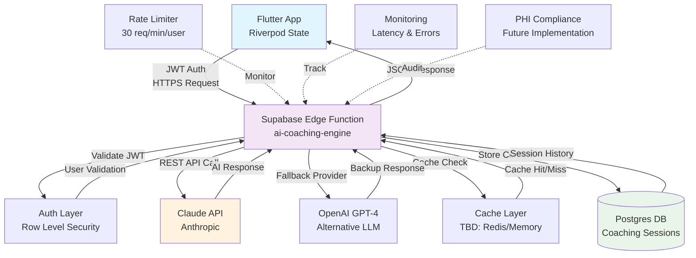

# AI Coaching Architecture - BEE MVP

**Document Version:** 1.0  
**Last Updated:** January 2025  
**Epic:** M1.3.1 - AI Coaching Architecture  
**Status:** Planning Phase

---

## 🧠 Executive Summary

The AI Coaching Engine represents the core intelligence layer of the BEE MVP, providing personalized behavioral coaching through real-time conversation and pattern analysis. This document outlines the technical architecture for integrating AI coaching capabilities into our existing Flutter + Supabase stack.

| Component | Technology | Status | Target Performance |
|-----------|------------|--------|-------------------|
| **AI Engine** | Claude API / OpenAI GPT-4 | Planning | < 1s p95 latency |
| **Edge Function** | Supabase Deno Runtime | Planning | 30 req/min/user |
| **Caching Layer** | TBD | Planning | 60% latency reduction |
| **Auth Integration** | JWT + RLS | Ready | Existing implementation |

---

## 🏗️ System Diagram 



---

## 🔌 Request/Response Contracts

### Endpoint Overview

| Endpoint | Method | Purpose | Rate Limit | Cache TTL |
|----------|--------|---------|------------|-----------|
| `/generate-response` | POST | Real-time coaching conversation | 30/min | 5 min |
| `/analyze-patterns` | POST | User behavior pattern analysis | 10/min | 1 hour |
| `/personalize-coaching` | POST | Adaptive coaching style tuning | 5/min | 24 hours |

### 1. Generate Coaching Response

**Endpoint:** `POST /functions/v1/ai-coaching-engine/generate-response`  
**Purpose:** Real-time conversational AI coaching

**Request Payload:**
```typescript
{
  "user_id": "uuid",
  "message": "I'm feeling overwhelmed with my goals today",
  "context": {
    "conversation_id": "string",
    "momentum_state": "Rising" | "Steady" | "NeedsCare",
    "recent_events": [
      {
        "event_type": "goal_completion",
        "timestamp": "2025-01-XX",
        "metadata": {...}
      }
    ],
    "emotional_context": {
      "detected_mood": "stressed" | "motivated" | "neutral",
      "confidence_score": 0.85
    },
    "session_metadata": {
      "platform": "mobile" | "web",
      "time_of_day": "morning" | "afternoon" | "evening"
    }
  }
}
```

**Response Payload:**
```typescript
{
  "response": {
    "message": "I understand you're feeling overwhelmed. Let's break this down into smaller steps...",
    "coaching_style": "supportive",
    "suggested_actions": [
      {
        "action_type": "breathing_exercise",
        "title": "2-Minute Mindful Breathing",
        "duration_seconds": 120
      }
    ],
    "follow_up_timing": "4_hours"
  },
  "metadata": {
    "response_time_ms": 850,
    "cache_hit": false,
    "provider": "claude",
    "tokens_used": 245
  }
}
```

### 2. Analyze User Patterns

**Endpoint:** `POST /functions/v1/ai-coaching-engine/analyze-patterns`  
**Purpose:** Behavioral pattern analysis for personalization

**Request Payload:**
```typescript
{
  "user_id": "uuid",
  "analysis_type": "engagement" | "goals" | "emotional",
  "timeframe_days": 30,
  "engagement_events": [
    {
      "event_type": "app_session",
      "timestamp": "2025-01-XX",
      "duration_seconds": 180,
      "features_used": ["momentum_meter", "today_feed"]
    }
  ]
}
```

**Response Payload:**
```typescript
{
  "patterns": {
    "engagement_peaks": ["morning", "evening"],
    "preferred_coaching_style": "educational",
    "goal_completion_rate": 0.73,
    "emotional_trends": {
      "dominant_mood": "motivated",
      "volatility_score": 0.3
    }
  },
  "recommendations": [
    {
      "type": "timing_optimization",
      "suggestion": "Schedule key coaching interactions for 9 AM and 7 PM"
    }
  ]
}
```

### 3. Personalize Coaching Style

**Endpoint:** `POST /functions/v1/ai-coaching-engine/personalize-coaching`  
**Purpose:** Adaptive coaching style based on user response history

**Request Payload:**
```typescript
{
  "user_id": "uuid",
  "current_style": "supportive" | "challenging" | "educational",
  "response_history": [
    {
      "coaching_message": "string",
      "user_response": "positive" | "negative" | "neutral",
      "engagement_score": 0.8,
      "timestamp": "2025-01-XX"
    }
  ],
  "style_preferences": {
    "tone": "casual" | "professional",
    "directness": "gentle" | "direct",
    "motivation_type": "intrinsic" | "extrinsic"
  }
}
```

---

## ⚙️ Runtime Components & Scaling

### Edge Function Architecture

**Runtime:** Supabase Deno Runtime  
**Memory Allocation:** 512MB (base), 1GB (burst)  
**Cold Start Target:** < 100ms  
**Concurrent Requests:** 50 per function instance

### Scaling Strategy

| Load Level | Users | Req/Min | Function Instances | Expected Response Time |
|------------|-------|---------|-------------------|----------------------|
| **Low** | < 100 | < 500 | 1-2 | 400-600ms |
| **Medium** | 100-1000 | 500-2000 | 3-5 | 600-800ms |
| **High** | 1000+ | 2000+ | 5-10 | 800-1000ms |

### Caching Strategy

**TODO: Technology Selection Required**
- **Options:** Redis, Supabase Edge Cache, In-Memory LRU
- **Cache Keys:** `user_id:conversation_id:message_hash`
- **TTL Strategy:** 5 min (responses), 1 hour (patterns), 24 hour (personalization)
- **Invalidation:** User-triggered style changes, new behavior patterns

---

## 🚫 Error & Rate-Limit Strategy

### Rate Limiting Implementation

```typescript
// Rate limit configuration per endpoint
const RATE_LIMITS = {
  generate_response: { requests: 30, window: 60 }, // 30 req/min
  analyze_patterns: { requests: 10, window: 60 },  // 10 req/min  
  personalize_coaching: { requests: 5, window: 60 }  // 5 req/min
};
```

### Error Handling Hierarchy

1. **Client-Side Errors (4xx)**
   - Invalid JWT: Return auth challenge
   - Malformed request: Return validation errors
   - Rate limit exceeded: Return retry-after header

2. **Server-Side Errors (5xx)**
   - LLM API failure: Fallback to secondary provider
   - Cache unavailable: Direct LLM call with degraded performance
   - Database errors: Return cached response or graceful fallback

3. **Fallback Strategy**
   - Primary: Claude API → OpenAI GPT-4 → Cached response → Generic coaching message

### Circuit Breaker Pattern

- **Failure Threshold:** 5 consecutive failures per provider
- **Recovery Timeout:** 30 seconds
- **Health Check:** Periodic lightweight API calls

---

## 🔐 Security & Auth Touchpoints

### JWT Integration

**Auth Flow:**
1. Flutter app authenticates via Supabase Auth
2. JWT token forwarded to Edge Function
3. Edge Function validates JWT signature
4. User context extracted from `auth.uid()`
5. RLS policies enforce data access control

**JWT Validation Code Pattern:**
```typescript
// Edge Function auth validation
const jwt = request.headers.get('Authorization')?.replace('Bearer ', '');
const { data: user, error } = await supabase.auth.getUser(jwt);
if (error || !user) {
  return new Response('Unauthorized', { status: 401 });
}
```

### Row Level Security (RLS)

**Existing RLS Policies Applied:**
- `coaching_sessions` table: Users can only access their own sessions
- `user_patterns` table: Pattern data isolated per user
- `coaching_preferences` table: Personal coaching settings protected

### Data Privacy Considerations

**Current Implementation:**
- All coaching conversations stored with user_id isolation
- JWT-based access control at API and database level
- No cross-user data leakage through RLS enforcement

**TODO: PHI Compliance (Future Epic)**
- Enhanced logging and audit trails
- Data retention policies
- HIPAA/GDPR compliance framework
- Encryption at rest for sensitive coaching data

---

## 🗺️ Roadmap / TODOs

### Phase 1: Core Implementation (Epic 1.3)
- [ ] **Edge Function Setup**: Create `functions/ai-coaching-engine/` with Deno runtime
- [ ] **LLM Integration**: Primary OpenAI fallback
- [ ] **Basic Caching**: Simple in-memory LRU cache implementation
- [ ] **Auth Integration**: JWT validation and RLS policy enforcement
- [ ] **Rate Limiting**: Per-user request throttling
- [ ] **Error Handling**: Comprehensive fallback strategy

### Phase 2: Performance & Reliability
- [ ] **TODO: Cache Technology Selection**
  - Evaluate Redis vs Supabase Edge Cache vs Memory-based
  - Implement distributed caching for multi-instance scaling
  
- [ ] **TODO: Prompt Safety Guidelines**
  - Content filtering for inappropriate user inputs
  - AI response validation and safety checks
  - Harmful content detection and escalation procedures
  
- [ ] **Monitoring & Observability**
  - Real-time latency tracking
  - Error rate monitoring per endpoint
  - LLM provider cost tracking

### Phase 3: Advanced Features & Compliance
- [ ] **TODO: Full PHI Logging Implementation**
  - Comprehensive audit trails
  - Data retention and deletion policies
  - Compliance reporting framework
  
- [ ] **Advanced Personalization**
  - Machine learning-based coaching style optimization
  - Predictive engagement timing
  - Multi-modal coaching (text, voice, visual)

### Phase 4: Scale & Optimization
- [ ] **Performance Optimization**
  - Sub-500ms response time optimization
  - Advanced caching strategies
  - Edge deployment for global latency reduction
  
- [ ] **Advanced AI Features**
  - Emotional intelligence integration
  - Predictive intervention timing
  - Multi-conversation context awareness

---

**Next Steps:** Begin Phase 1 implementation with Edge Function creation and basic LLM integration. 