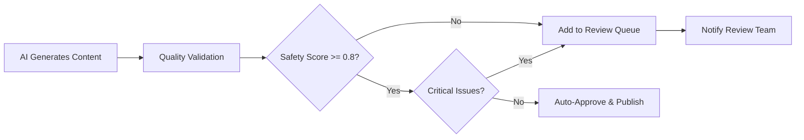
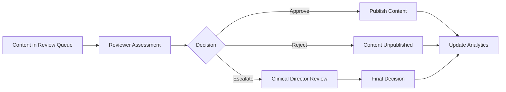

# Medical Safety Review System

**Epic 1.3: Today Feed (AI Daily Brief) - Task T1.3.1.5**  
**Feature**: Human review workflow for AI-generated health content  
**Version**: 1.0  
**Status**: ✅ Complete  

---

## 📋 Overview

The Medical Safety Review System provides a comprehensive human review workflow for AI-generated health content that requires additional safety validation. Content is automatically flagged for review based on safety scores and identified issues, ensuring medical accuracy and appropriateness before publication.

### **Key Features**
- **Automated Flagging**: AI validation automatically identifies content requiring review
- **Review Queue**: Centralized queue for pending content reviews
- **Reviewer Actions**: Approve, reject, or escalate content with detailed notes
- **Audit Trail**: Complete history of all review actions and decisions
- **Notifications**: Automated alerts to review team for new flagged content
- **Escalation Process**: Clinical director review for complex medical topics
- **Analytics**: Review performance metrics and statistics

---

## 🔄 Review Workflow

### **1. Content Generation & Initial Validation**


### **2. Human Review Process**


### **3. Review Thresholds**
- **Auto-Approve**: Safety score ≥ 0.95 + Quality score ≥ 0.9 + No critical issues
- **Require Review**: Safety score < 0.8 OR medical safety issues detected
- **Escalation**: Complex medical claims, emergency language, or reviewer uncertainty

---

## 🛠 API Endpoints

### **Review Queue Management**

#### **GET /review/queue**
Retrieve pending content reviews.

**Query Parameters:**
- `status` (optional): Filter by review status (default: `pending_review`)
  - Values: `pending_review`, `approved`, `rejected`, `escalated`
- `limit` (optional): Number of items to return (default: 20)
- `offset` (optional): Pagination offset (default: 0)

**Example Request:**
```bash
curl -X GET "https://your-service.run.app/review/queue?status=pending_review&limit=10"
```

**Response:**
```json
{
  "success": true,
  "pending_reviews": [
    {
      "id": 123,
      "content_date": "2024-12-15",
      "title": "The Hidden Benefits of Intermittent Fasting",
      "summary": "Recent studies suggest intermittent fasting may help regulate blood sugar and reduce inflammation markers.",
      "topic_category": "nutrition",
      "ai_confidence_score": 0.82,
      "safety_score": 0.75,
      "flagged_issues": [
        "Contains medical term: regulate blood sugar",
        "Content lacks appropriate cautious language for health topics"
      ],
      "review_status": "pending_review",
      "created_at": "2024-12-15T03:00:00Z"
    }
  ],
  "total_count": 5
}
```

#### **POST /review/action?id={review_item_id}**
Submit reviewer action (approve/reject/escalate).

**Request Body:**
```json
{
  "action": "approve",
  "reviewer_id": "reviewer_001",
  "reviewer_email": "dr.smith@bee-health.com",
  "notes": "Content is factually accurate and appropriately cautious. Good educational value.",
  "escalation_reason": "Complex medical claims require clinical director review"
}
```

**Response:**
```json
{
  "success": true,
  "updated_item": {
    "id": 123,
    "review_status": "approved",
    "reviewer_id": "reviewer_001",
    "reviewer_email": "dr.smith@bee-health.com",
    "review_notes": "Content is factually accurate...",
    "reviewed_at": "2024-12-15T10:30:00Z"
  },
  "published_content": {
    "id": 456,
    "content_date": "2024-12-15",
    "title": "The Hidden Benefits of Intermittent Fasting",
    "summary": "Recent studies suggest...",
    "created_at": "2024-12-15T10:30:00Z"
  }
}
```

#### **GET /review/stats?days={number}**
Get review performance statistics.

**Query Parameters:**
- `days` (optional): Number of days to include in statistics (default: 7)

**Response:**
```json
{
  "success": true,
  "statistics": [
    {
      "review_date": "2024-12-15",
      "total_reviews": 8,
      "approved_count": 6,
      "rejected_count": 1,
      "escalated_count": 1,
      "pending_count": 0,
      "avg_safety_score": 0.83,
      "avg_review_time_hours": 2.5
    }
  ],
  "period_days": 7
}
```

---

## 💾 Database Schema

### **Content Review Queue Table**
```sql
CREATE TABLE content_review_queue (
    id SERIAL PRIMARY KEY,
    content_id INTEGER REFERENCES daily_feed_content(id),
    content_date DATE NOT NULL,
    title TEXT NOT NULL,
    summary TEXT NOT NULL,
    topic_category TEXT NOT NULL,
    ai_confidence_score NUMERIC(3,2),
    safety_score NUMERIC(3,2),
    flagged_issues JSONB DEFAULT '[]',
    review_status TEXT DEFAULT 'pending_review',
    reviewer_id TEXT,
    reviewer_email TEXT,
    review_notes TEXT,
    reviewed_at TIMESTAMP WITH TIME ZONE,
    escalated_at TIMESTAMP WITH TIME ZONE,
    escalation_reason TEXT,
    created_at TIMESTAMP WITH TIME ZONE DEFAULT NOW(),
    updated_at TIMESTAMP WITH TIME ZONE DEFAULT NOW()
);
```

### **Review Actions Audit Table**
```sql
CREATE TABLE content_review_actions (
    id SERIAL PRIMARY KEY,
    review_item_id INTEGER REFERENCES content_review_queue(id),
    action_type TEXT NOT NULL,
    reviewer_id TEXT NOT NULL,
    reviewer_email TEXT NOT NULL,
    notes TEXT,
    escalation_reason TEXT,
    action_timestamp TIMESTAMP WITH TIME ZONE DEFAULT NOW()
);
```

### **Review Notifications Table**
```sql
CREATE TABLE content_review_notifications (
    id SERIAL PRIMARY KEY,
    notification_type TEXT NOT NULL,
    review_item_id INTEGER REFERENCES content_review_queue(id),
    content_date DATE NOT NULL,
    title TEXT NOT NULL,
    recipient_email TEXT NOT NULL,
    reviewer_email TEXT,
    escalation_reason TEXT,
    sent BOOLEAN DEFAULT FALSE,
    sent_at TIMESTAMP WITH TIME ZONE,
    created_at TIMESTAMP WITH TIME ZONE DEFAULT NOW()
);
```

---

## 🔒 Security & Access Control

### **Row Level Security (RLS)**
- **Review Queue**: Accessible only to users with `reviewer` or `admin` role
- **Review Actions**: Reviewers can only see their own actions, admins see all
- **Notifications**: Recipients can only see their own notifications

### **Reviewer Roles**
- **Clinical Reviewer**: Basic content review and approval authority
- **Content Safety Reviewer**: Focus on safety and appropriateness issues
- **Clinical Director**: Escalation authority for complex medical content
- **Admin**: Full system access and user management

### **API Authentication**
- Service-to-service calls use `service_role` with full access
- Human reviewers authenticate with JWT tokens containing role claims
- All API calls include proper authorization validation

---

## 📊 Content Flagging Criteria

### **Automatic Review Triggers**
1. **Safety Score < 0.8**: Content fails automated safety validation
2. **Medical Terms**: Contains prohibited medical terminology (diagnose, prescribe, cure, etc.)
3. **Medical Claims**: Makes inappropriate health or disease claims
4. **Emergency Language**: Contains urgent or crisis-related language
5. **Inappropriate Content**: Age-inappropriate or harmful behavior promotion

### **Auto-Approval Criteria**
1. **High Safety Score**: Safety score ≥ 0.95
2. **High Quality Score**: Overall quality ≥ 0.9
3. **No Critical Issues**: No medical, emergency, or inappropriate content flags
4. **Appropriate Language**: Uses cautious, educational language

### **Escalation Criteria**
1. **Complex Medical Claims**: Advanced health science or conflicting research
2. **Reviewer Uncertainty**: When reviewer requests clinical director input
3. **Legal/Compliance Issues**: Potential regulatory or liability concerns
4. **Controversial Topics**: Sensitive health topics requiring expert review

---

## 📈 Analytics & Monitoring

### **Key Performance Indicators**
- **Review Volume**: Number of items requiring review per day
- **Review Time**: Average time from flagging to decision
- **Approval Rate**: Percentage of content approved vs. rejected
- **Safety Score Distribution**: Distribution of AI safety scores
- **Escalation Rate**: Percentage of content escalated to clinical director

### **Dashboard Views**
- **Pending Reviews**: Current review queue with priority levels
- **Review Statistics**: Historical performance metrics
- **Content Performance**: Published content engagement after review

### **Alerting**
- **High Volume**: Alert when review queue exceeds capacity
- **Long Pending**: Alert for content pending review > 24 hours
- **Low Safety Scores**: Alert when multiple items have safety scores < 0.7
- **Failed Notifications**: Alert when notification delivery fails

---

## 🚨 Error Handling & Fallbacks

### **Review Queue Failures**
- **Database Connection**: Graceful degradation with in-memory queueing
- **Validation Errors**: Detailed error logging and retry mechanisms
- **Notification Failures**: Fallback notification channels (email → Slack → SMS)

### **Content Publication Fallbacks**
- **Approved Content**: Always publishes to main content table
- **Review Timeout**: Escalate to clinical director after 48 hours
- **No Available Content**: Use previously approved content as fallback
- **Emergency Override**: Admin ability to fast-track critical content

### **Data Integrity**
- **Audit Trail**: All review actions permanently logged
- **Backup Systems**: Regular backups of review queue and decisions
- **Recovery Procedures**: Documented process for system restoration

---

## 🔧 Configuration

### **Environment Variables**
```bash
# Review System Thresholds
SAFETY_SCORE_THRESHOLD=0.8
AUTO_APPROVE_THRESHOLD=0.95
OVERALL_QUALITY_THRESHOLD=0.8

# Notification Settings
REVIEW_TEAM_EMAILS="clinical-review@bee-health.com,content-safety@bee-health.com"
CLINICAL_DIRECTOR_EMAIL="clinical-director@bee-health.com"
NOTIFICATION_ENABLED=true

# Performance Settings
MAX_REVIEW_QUEUE_SIZE=100
REVIEW_TIMEOUT_HOURS=48
NOTIFICATION_RETRY_ATTEMPTS=3
```

### **Reviewer Team Configuration**
```json
{
  "review_team": [
    {
      "email": "dr.smith@bee-health.com",
      "role": "clinical_reviewer",
      "specialties": ["nutrition", "exercise"],
      "max_daily_reviews": 20
    },
    {
      "email": "safety.expert@bee-health.com", 
      "role": "content_safety_reviewer",
      "specialties": ["all"],
      "max_daily_reviews": 30
    },
    {
      "email": "clinical.director@bee-health.com",
      "role": "clinical_director",
      "escalation_only": true
    }
  ]
}
```

---

## 🧪 Testing

### **Test Cases**
1. **Content Flagging**: Verify content is correctly flagged for review
2. **Review Actions**: Test approve, reject, and escalate workflows
3. **Notifications**: Confirm review team receives alerts
4. **Data Integrity**: Validate audit trail completeness
5. **Access Control**: Test RLS policies and role permissions
6. **Error Handling**: Test failure scenarios and recovery
7. **Performance**: Load testing with high review volumes

### **Test Data**
```json
{
  "flagged_content": {
    "title": "How to Cure Diabetes Naturally",
    "summary": "This simple trick will cure your diabetes in 30 days without medication.",
    "expected_issues": [
      "Contains prohibited medical term: cure",
      "Contains inappropriate medical claim: cure diabetes", 
      "Promotes potentially harmful behavior: avoid medical care"
    ],
    "expected_safety_score": 0.2
  }
}
```

---

## 📝 Usage Examples

### **Reviewer Workflow**
```bash
# 1. Get pending reviews
curl -X GET "https://service.run.app/review/queue"

# 2. Review content and approve
curl -X POST "https://service.run.app/review/action?id=123" \
  -H "Content-Type: application/json" \
  -d '{
    "action": "approve",
    "reviewer_id": "dr_smith",
    "reviewer_email": "dr.smith@bee-health.com",
    "notes": "Content is medically accurate and appropriately cautious."
  }'

# 3. Check review statistics
curl -X GET "https://service.run.app/review/stats?days=7"
```

### **Content Generation with Review**
```javascript
// Generate content (may trigger review)
const response = await fetch('/generate', {
  method: 'POST',
  body: JSON.stringify({
    topic: 'nutrition',
    date: '2024-12-15'
  })
});

const result = await response.json();

if (result.requires_review) {
  console.log(`Content flagged for review: ${result.review_item_id}`);
  // Notify review team automatically via database triggers
} else {
  console.log(`Content auto-approved and published: ${result.content.id}`);
}
```

---

## 🔄 Future Enhancements

### **Phase 2 Features**
- **Machine Learning**: Improve flagging accuracy with ML models
- **Reviewer Scheduling**: Automatic reviewer assignment and load balancing
- **Content Versioning**: Track content changes through review process
- **Batch Operations**: Bulk approve/reject for routine content
- **Integration APIs**: Connect with external medical validation services

### **Phase 3 Features**
- **Real-time Collaboration**: Multiple reviewers on same content
- **Automated Corrections**: AI-suggested content improvements
- **Quality Prediction**: Predict content quality before generation
- **Expert Networks**: Connect with external medical experts
- **Regulatory Compliance**: Automated compliance checking

---

**Last Updated**: December 2024  
**System Status**: ✅ Operational  
**Next Review**: Weekly team standup  
**Documentation Owner**: Engineering Team  
**Clinical Oversight**: Clinical Director 